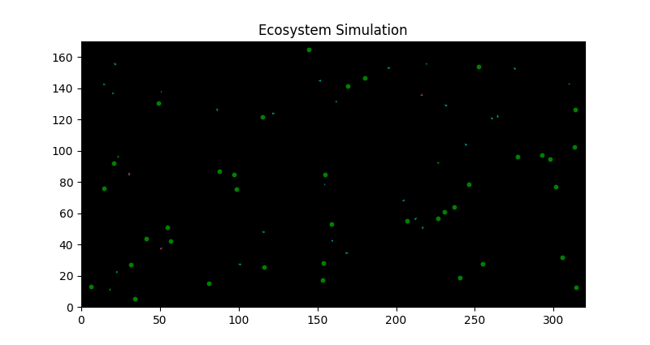

# ESP32 Micro Ecosystem Simulator 🌱🐟🦈🐉

### Real Hardware (ESP32 + 1.9" TFT)


### Python Simulator


A highly optimized, high-performance artificial life / ecosystem simulation designed to run on the ESP32 and a 1.9" TFT display (ST7789). Watch a completely autonomous, pixel-perfect ecosystem unfold in the palm of your hand!

## ✨ Features

- **Multi-Core Optimization**: Uses FreeRTOS to divide the workload. Core 0 handles the complex physics, collision detection, and AI logic, while Core 1 is strictly dedicated to pushing pixels to the TFT display via SPI.
- **7 Trophic Levels / Entities**:
  - 🌱 **Plants (Green)**: The base of the food chain. Spawns over time and from decomposers.
  - 🐟 **Herbivores (Cyan)**: Eats plants, breeds when energetic.
  - 🦈 **Carnivores (Pink)**: Hunts herbivores. Features an "adrenaline rush" mechanic to escape apex predators.
  - 🐉 **Apex Predators (Gold)**: The kings of the ecosystem. Hunts carnivores.
  - 🦠 **Spores (Purple)**: A viral element that infects animals, making them erratic before killing them and spreading.
  - ☠️ **Garbage/Corpses (Dark X)**: Left behind when an animal dies.
  - ♻️ **Decomposers (Lime)**: Nature's cleaners. They eat garbage and spores, eventually blossoming into new plants to complete the circle of life.
- **Boids-like AI & Physics**: Entities have their own vision ranges, target tracking, fleeing mechanics, and kinetic movement with friction.
- **Dynamic Tail Rendering**: Uses a custom highly-optimized `drawWedgeLine` algorithm to draw dynamic, fading tails for creatures based on their movement history, giving them a fluid, organic look.
- **Zero-Player Game (Ambient Game)**: Just plug it in and watch the ecosystem balance itself out. Perfect as a desk toy!

## 🛠 Hardware Requirements

- **ESP32** (Standard Dual-Core version)
- **IdeaSpark 1.9" TFT LCD** (ST7789 controller, 170x320 resolution, BGR color order)

### Wiring (Default)
- **TFT_CS**: 5
- **TFT_RST**: 4
- **TFT_DC**: 2
- **TFT_MOSI**: 23
- **TFT_SCLK**: 18
- **TFT_BL**: 32 (Backlight)

## 🚀 How to Run

1. Open `ecosystem_sim.ino` in the Arduino IDE.
2. Install the **TFT_eSPI** library by Bodmer.
3. Configure your `User_Setup.h` in the TFT_eSPI library to match the ST7789 170x320 display and the pins listed above.
4. Compile and flash to your ESP32.
5. Watch the simulation run!

## 📊 Python Simulator included!

Want to test the balance of the ecosystem without flashing the ESP32? 
Run the included `sim.py`! It simulates 30,000 steps of the ecosystem logic and generates a beautiful population dynamics graph (`ecosystem_plot.png`) using `matplotlib`.

```bash
pip install matplotlib
python sim.py
```

## 🤝 Contributing
Feel free to fork this project and add your own creatures, weather systems, or environmental mechanics. Let's make the most complex pocket ecosystem together!
