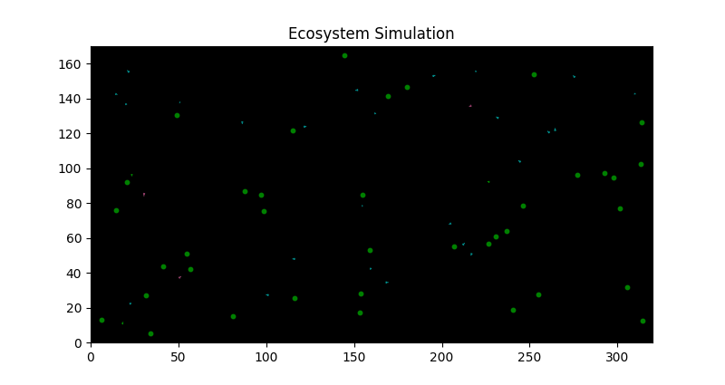

# ESP32 Micro Ecosystem Simulator

### Real Hardware (ESP32 + 1.9" TFT)

### Python Simulator

A highly optimized, high-performance artificial life / ecosystem simulation designed to run on the ESP32 and a 1.9" TFT display (ST7789). Watch a completely autonomous, pixel-perfect ecosystem unfold in the palm of your hand!

## Online Emulator (ESP32)

You can try the simulation directly in your browser:
[Run on Wokwi](https://wokwi.com/projects/470557640925776897)

*Note: The code is highly optimized for the physical ESP32 hardware. Running it in a browser emulator may be slow and consume high CPU/Memory.*

## Pure Python & Web Version (High-Res)

Want to see the pure ecosystem logic without the ESP32 hardware limits? 
We have spun off the Python implementation into its own dedicated repository! It features a high-resolution real-time GUI (Pygame) and runs smoothly on PC.

**Play the WebAssembly version directly in your browser:**
[Play Web Version](https://ootake0914-dotcom.github.io/ecosystem-sim/)

**Check out the Python source code:**
[ecosystem-sim (Python Repository)](https://github.com/ootake0914-dotcom/ecosystem-sim)

## CYD (Cheap Yellow Display) Version

Do you have a **Cheap Yellow Display (CYD / ESP32-2432S028)** board?
We have created a dedicated port configured for the 2.8" TFT display and touch interface!

**Check out the CYD version:**
[cyd-version / cyd-ecosystem-sim](cyd-version/)

## Features

- **Multi-Core Optimization**: Uses FreeRTOS to divide the workload. Core 0 handles the complex physics, collision detection, and AI logic, while Core 1 is strictly dedicated to pushing pixels to the TFT display via SPI.
- **7 Trophic Levels / Entities**:
  - **Plants (Green)**: The base of the food chain. Spawns over time and from decomposers.
  - **Herbivores (Cyan)**: Eats plants, breeds when energetic.
  - **Carnivores (Pink)**: Hunts herbivores. Features an "adrenaline rush" mechanic to escape apex predators.
  - **Apex Predators (Gold)**: The kings of the ecosystem. Hunts carnivores.
  - **Spores (Purple)**: A viral element that infects animals, making them erratic before killing them and spreading.
  - **Garbage/Corpses (Dark X)**: Left behind when an animal dies.
  - **Decomposers (Lime)**: Nature's cleaners. They eat garbage and spores, eventually blossoming into new plants to complete the circle of life.
- **Boids-like AI & Physics**: Entities have their own vision ranges, target tracking, fleeing mechanics, and kinetic movement with friction.
- **Genetic Evolution & Natural Selection**: 
  - **Altruism Gene**: Entities inherit an `altruism` gene. Altruistic herbivores share energy with starving kin and self-isolate when infected.
  - **Immunity Gene**: A high `immunity` gene chance-blocks virus infections with a white spark, but costs high baseline energy (metabolism). In peaceful times, low-immunity efficient breeders thrive. During a pandemic, they die out and only high-immunity individuals survive, creating a dynamic Red Queen hypothesis scenario!
  - **Speed Gene**: Speed is inherited. Fast individuals outrun predators but starve easily, while slow individuals survive famines.
- **Veteran Color Shift**: As entities survive and age, their colors evolve into distinct "Veteran" forms to visually show their experience (e.g., Herbivores turn Emerald Green, Carnivores turn Blood Red, Apex Predators turn Platinum).
- **Dynamic Tail Rendering**: Uses a custom highly-optimized `drawWedgeLine` algorithm to draw dynamic, fading tails for creatures based on their movement history, giving them a fluid, organic look.
- **Zero-Player Game (Ambient Game)**: Just plug it in and watch the ecosystem balance itself out. Perfect as a desk toy!

## Hardware Requirements

- **ESP32** (Standard Dual-Core version)
- **IdeaSpark 1.9" TFT LCD** (ST7789 controller, 170x320 resolution, BGR color order)

### Wiring (Default)
- **TFT_CS**: 5
- **TFT_RST**: 4
- **TFT_DC**: 2
- **TFT_MOSI**: 23
- **TFT_SCLK**: 18
- **TFT_BL**: 32 (Backlight)

## How to Run

1. Open `ecosystem_sim.ino` in the Arduino IDE.
2. Install the **TFT_eSPI** library by Bodmer.
3. Configure your `User_Setup.h` in the TFT_eSPI library to match the ST7789 170x320 display and the pins listed above.
4. Compile and flash to your ESP32.
5. Watch the simulation run!

## Contributing
Feel free to fork this project and add your own creatures, weather systems, or environmental mechanics. Let's make the most complex pocket ecosystem together!

## Web Installer

Flash directly to your CYD board from your Web Browser without installing Arduino IDE or any software!

- **Web Installer Page**: [https://ootake0914-dotcom.github.io/esp32-ecosystem-sim/](https://ootake0914-dotcom.github.io/esp32-ecosystem-sim/)

*(Requires Chrome, Edge, or any browser with Web Serial API support)*

